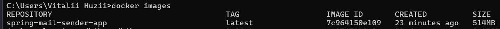
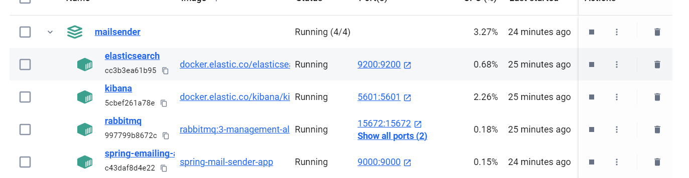
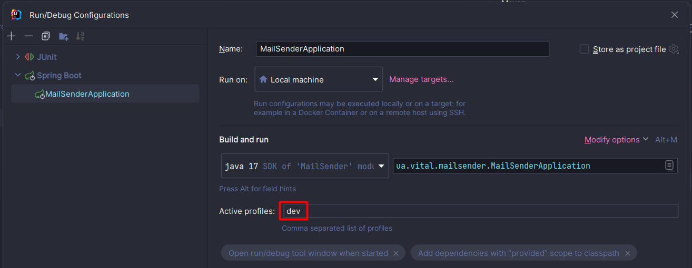
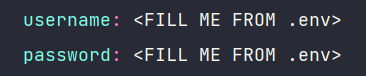

## To make the implemented Java microservice in this repository accept RabbitMQ messages to send emails you need to have an already running service which is implemented here: [Secure-File-System-Web](https://github.com/vital-xvv/Secure-File-System-Web), which is a producer of the messages in Message Broker.

# Project Setup with Docker

1. Build an executable JAR archive of the implememnted Java mircoservice.

   Run `mvn clean package -Dmaven.test.skip`

   We are skipping integrational tests while packaging of our project because we need running instances of elasticsearch and rabbitmq images in docker containers.

   After running this command you may see a newly created .jar file like this:

   

2. Later run this command to create an image of the implemented microservice in Docker.

   Run `docker build -t spring-mail-sender-app .`

   After a completion of the step you may notice a newly created image of the implemented Java microservice.

3. Lastly run this command to pull all needed images of additional microcervices and create corresponding containers in Docker.

   Run `docker-compose up`

   After running this commn=and all containers should have a "RUNNING" status:

# Running Project in "dev" mode

1. Make sure before running the application in development mode you set up an active profile property in running configurations like this:

2. You filled in missing corresponding properties from .env file in application-dev.yml that look like this:

# Running integrational tests

### **Caution! To run integrational tests of the application make sure you have running instances of Elasticsearch and RabbitMQ microservices on your local machine on special porst specified in application-test.yml file whether in Docker or as standalone apps**.
